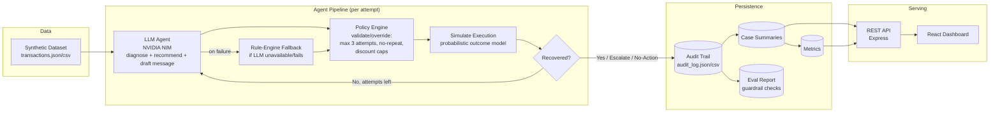

# Recovery Agent

**AI-powered revenue recovery for failed payments & abandoned checkouts.**
Built for the Razorpay AI Buildathon — Track 03: AI Revenue Recovery.

Recovery Agent watches a stream of failed/abandoned Indian fintech transactions. For every one, a **real LLM** (via NVIDIA NIM) **diagnoses why it failed** and **recommends a recovery action** — but that recommendation is never executed blindly. A separate, plain-code **policy engine** validates or overrides it against hard compliance limits (max 3 attempts, no spam, capped discounts) before anything is simulated and logged. Every diagnosis, AI recommendation, policy decision, message, and outcome is written to a structured audit trail. An automated **eval suite** then re-checks that trail to mechanically prove the guardrails actually held.

---

## Problem statement

Failed payments and abandoned checkouts are one of the largest silent revenue leaks in Indian fintech/e-commerce — card declines, OTP timeouts, insufficient funds, and flaky bank/network infra routinely kill 10-20% of transaction volume. Most of that revenue is recoverable with the right nudge at the right time, but doing it well requires:

1. Correctly diagnosing *why* a payment failed (not all failures are equal).
2. Choosing a recovery action that matches the failure — not spamming everyone with the same discount.
3. Knowing when **not** to act, and when to stop and hand off to a human.
4. Being fully auditable — every automated customer-facing action needs a paper trail, and the safety limits need to hold *even if the AI proposes something unsafe*.

Recovery Agent is a working, end-to-end system that does all four.

---

## What I built

| Layer | What it does |
|---|---|
| **Synthetic dataset** | 92 realistic Indian fintech transaction records (UPI/card/netbanking failures, subscription + one-off payments) — `server/data/transactions.json` / `.csv` |
| **LLM agent** | Calls an NVIDIA NIM-hosted model per attempt to diagnose root cause + severity, recommend an action, and draft the Hinglish message — `server/src/llmAgent.js`, `server/src/llmClient.js` |
| **Policy engine** | Plain, deterministic code that validates/overrides the AI's recommendation against hard limits — never delegated to the model — `server/src/policy.js` |
| **Rule-based fallback engine** | If the LLM is unavailable or misbehaves, the same attempt falls back to a fully deterministic classifier + decision table, so the pipeline never stalls — `server/src/classify.js`, `server/src/decide.js`, `server/src/message.js` |
| **Simulation layer** | Probabilistic (not random) outcome model grounded in action/root-cause/attempt-number — `server/src/simulate.js` |
| **Audit trail** | Every AI diagnosis, AI recommendation, policy decision (incl. overrides), message, and outcome, for every attempt, written to JSON + CSV — `server/audit/audit_log.json` |
| **Guardrail evals** | An automated check suite that re-verifies the audit trail actually respected every compliance rule — `server/src/evals.js` → `server/audit/eval_report.json` |
| **REST API** | Serves metrics, case list (filterable), and per-case audit detail — `server/src/server.js` |
| **React dashboard** | Fintech-ops-style console: KPIs, charts, searchable audit log, per-case drill-down showing AI vs. rule-engine source and any policy override — `client/` |

---

## Architecture



Every transaction runs through a **bounded agent loop**, attempt by attempt: the LLM (or its rule-based fallback) proposes a diagnosis + action + message → the policy engine approves or overrides it → the action is simulated → the loop continues only while attempts remain and the last action wasn't terminal (escalate / no-action). Each iteration is one audit entry, so a single transaction can produce 1-3 entries — the full negotiation, not just the final outcome.

---

## Why the AI doesn't hold the safety limits

The buildathon brief explicitly calls for "**compliant escalation processes and stopping rules**" and "**bounded workflows with appropriate safeguards**." An LLM can be prompted to respect limits, but prompts are not guarantees — models drift, hallucinate, or occasionally ignore instructions. So the split here is deliberate:

- The **LLM's job** is judgment: diagnosing an ambiguous failure reason, weighing severity, choosing the most natural next lever, writing a message that doesn't sound robotic.
- The **policy engine's job** (`policy.js`) is arithmetic: attempt counts, repeat-action checks, discount floors/caps. It re-validates *every* proposal — from the LLM or the fallback engine — and silently substitutes a safe action when a proposal would violate a rule, logging exactly why.

Concretely, `policy.js` enforces:
- **Max 3 recovery attempts per customer** — hard stop, forces escalation regardless of what was proposed.
- **No repeated identical action back-to-back** — a different lever is substituted automatically.
- **Discounts are capped at 15%, gated above a ₹500 floor, and offered at most once per case.**
- **Unrecognized/malformed model output** is treated as a policy violation and routed to human escalation rather than executed.
- **Low-value, likely self-resolving cases** don't get a discount or escalation on the first attempt — the agent can (and does) choose `no_action_needed`, logged with reasoning, not silently skipped. This is the **false-action rate** metric.

See `TXN20260800054` in the audit log for a case that hits all 3 attempts and is closed gracefully rather than looped forever, and search the audit log for `"overridden_by_policy": true` to see the policy engine actively correcting an AI proposal.

---

## Guardrails are proven, not just claimed

After every pipeline run, `npm run eval` re-reads the audit trail it just produced and mechanically checks 11 compliance properties — not "we designed it to be bounded," but "here is proof, on this exact run, that it was":

```
Guardrail evals: 11/11 passed

  ✓ No case exceeds MAX_ATTEMPTS
  ✓ No back-to-back repeated action (no-spam)
  ✓ Discount never exceeds cap
  ✓ Discount never below amount floor
  ✓ Discount never offered twice on the same case
  ✓ Every audit entry has decision reasoning
  ✓ Every audit entry has a message/internal note
  ✓ No case recovers more than its own at-risk amount
  ✓ Total recovered <= total at risk
  ✓ No-action cases never show recovered amount
  ✓ Escalations only occur after a real attempt was made
```

Written to `server/audit/eval_report.json`; exits non-zero on any failure so it can gate CI.

---

## Setup & run

Requires **Node.js 18+**.

```bash
# 1. Backend
cd server
npm install
cp .env.example .env        # then paste your NVIDIA_API_KEY (see below)
npm run generate            # writes server/data/transactions.{json,csv}
npm run run-pipeline        # writes server/audit/{audit_log,case_summaries,metrics}.json
npm run eval                # writes server/audit/eval_report.json
npm start                   # http://localhost:4000 (also re-runs the pipeline on boot)

# 2. Frontend — in a second terminal
cd client
npm install
npm run dev                 # http://localhost:5173 (proxies /api to :4000)
```

Open **http://localhost:5173** for the dashboard. Click **"↻ Re-run pipeline"** in the top bar to trigger a fresh run live (calls `POST /api/run`).

### Enabling real LLM reasoning

Get a free key at **[build.nvidia.com](https://build.nvidia.com)** — open any model page and click "Get API Key." Put it in `server/.env`:

```
NVIDIA_API_KEY=nvapi-your-key-here
NVIDIA_MODEL=meta/llama-3.1-70b-instruct   # optional, this is the default — swap for
                                            # any model ID your build.nvidia.com account has access to
```

With no key set, the pipeline runs entirely on the deterministic rule engine — same audit trail shape, same guarantees, just without live model calls. The dashboard's top-right badge always shows which mode produced the current run ("AI-Live · model-name" or "Rule Engine (no LLM key)"), and every audit entry is individually tagged `agent_source: "llm" | "rule_engine"` so a judge can see exactly which cases used which path.

### API reference

| Endpoint | Description |
|---|---|
| `GET /api/health` | Liveness + whether LLM mode is currently enabled |
| `GET /api/metrics` | Full computed metrics object |
| `GET /api/cases` | Case list, filterable by `?failure_reason=&severity=&status=&action=&q=` |
| `GET /api/cases/:transactionId` | One case + its complete audit trail |
| `GET /api/audit` | Raw audit entries, optional `?transaction_id=` |
| `POST /api/run` | Re-runs the full pipeline (fresh dataset read, fresh simulation) |

---

## Sample output

One audit entry (`server/audit/audit_log.json`) from an LLM-mode run, lightly trimmed — note the AI's proposal, the policy engine's independent decision, and the fact that they can differ:

```json
{
  "audit_id": "AUD00042",
  "transaction_id": "TXN20260800017",
  "customer_name": "Ananya Iyer",
  "amount_inr": 180,
  "attempt_number": 1,
  "agent_source": "llm",
  "classification": {
    "root_cause_category": "transient_infra",
    "severity": "low",
    "reasoning": "Bank server was down at the time of charge — a one-off infra glitch unrelated to the customer, low value at ₹180."
  },
  "llm_proposed_action": "discount_offer",
  "llm_decision_reasoning": "Offering a small discount to reassure the customer despite the low value.",
  "decision": {
    "action": "no_action_needed",
    "overridden_by_policy": true,
    "override_reason": "actionability_threshold_policy: amount (₹180) is below the ₹200 floor and non-recurring — a discount/escalation is not cost-justified, withholding action instead.",
    "reasoning": "actionability_threshold_policy: amount (₹180) is below the ₹200 floor and non-recurring — a discount/escalation is not cost-justified, withholding action instead."
  },
  "message": "[No customer-facing message sent] — agent determined outreach is not cost-justified for this case. See reasoning in audit log.",
  "outcome": { "status": "no_action", "recovered_amount": 0 }
}
```

*(Numbers above are illustrative of the override mechanism; run the pipeline with your own key for a live example, or without one to see the same shape from the rule engine.)*

---

## Measured results (rule-engine baseline run — nothing here is hand-typed)

Reproduce these exact numbers with `npm run generate && npm run run-pipeline` in `server/` (seeded RNG, deterministic; this baseline has no `NVIDIA_API_KEY` set):

| Metric | Value |
|---|---|
| Cases processed | **92** |
| Total agent attempts | **166** (avg 1.8 per case) |
| Recovery rate | **78.3%** overall · **87.8%** of cases the agent actually acted on |
| Amount recovered | **₹3,14,824** of **₹3,71,076** at risk |
| Avg time to recovery | **9.2 hours** |
| False-action rate | **10.9%** — cases the agent correctly chose *not* to act on |
| Escalated to human | **10 cases** — exhausted automation, handed off rather than guessed |
| Guardrail evals | **11/11 passed** |

Breakdowns by failure reason, action-conversion rate, and severity are all computed live and shown as charts on the dashboard. With a live `NVIDIA_API_KEY` set, re-run the pipeline to get an LLM-reasoned version of the same run — the dashboard badge and every audit entry will show `agent_source: "llm"`.

---

## What I'd build next

- **Real channel integrations** — actual WhatsApp Business API / SMS gateway / Razorpay payment links instead of simulated execution, with real webhook-driven outcome tracking instead of a probability model.
- **Per-customer cooldown windows** — currently bounded per-transaction; a production system would also cap total nudges per customer per week across transactions.
- **A/B testing the decision policy** — compare LLM-recommended actions against the rule-engine baseline on the same dataset to measure the actual lift the model provides, then feed that back into prompt tuning.
- **Persist to a real database** (Postgres) instead of flat JSON/CSV, with the dashboard reading live instead of from a static pipeline run.
- **Streaming/webhook-driven outcomes** instead of a one-shot simulation, so "time to recovery" reflects real customer response latency.

---

## Repo layout

```
recovery-agent/
├── server/                  # Node.js backend
│   ├── src/
│   │   ├── generateDataset.js
│   │   ├── llmClient.js     # NVIDIA NIM API client
│   │   ├── llmAgent.js      # LLM diagnosis + recommendation + message prompt
│   │   ├── policy.js        # hard guardrails — validates/overrides the AI
│   │   ├── classify.js      # deterministic fallback: root cause + severity
│   │   ├── decide.js        # deterministic fallback: action selection
│   │   ├── message.js       # deterministic fallback: Hinglish templates
│   │   ├── simulate.js      # probabilistic outcome model
│   │   ├── pipeline.js      # orchestrates the whole agent loop
│   │   ├── evals.js         # guardrail eval suite
│   │   ├── metrics.js
│   │   ├── audit.js
│   │   └── server.js
│   ├── data/                # generated dataset
│   ├── audit/                # generated audit trail, metrics, eval report
│   └── .env.example
└── client/                  # React (Vite) dashboard
    └── src/
        ├── App.jsx
        ├── api.js
        ├── format.js
        └── components/
```
