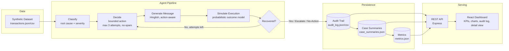

# Recovery Agent

**AI-powered revenue recovery for failed payments & abandoned checkouts.**
Built for the Razorpay AI Buildathon — Track 03: AI Revenue Recovery.

Recovery Agent watches a stream of failed/abandoned Indian fintech transactions, **diagnoses why each one failed**, **decides a bounded recovery action**, **simulates execution**, and writes **every decision + reasoning + result** to a structured audit trail. It stops itself — max 3 attempts per customer, no spam, escalate-or-close when automation has exhausted its value — and it says so out loud in the log, not just in code comments.

---

## Problem statement

Failed payments and abandoned checkouts are one of the largest silent revenue leaks in Indian fintech/e-commerce — card declines, OTP timeouts, insufficient funds, and flaky bank/network infra routinely kill 10-20% of transaction volume. Most of that revenue is recoverable with the right nudge at the right time, but doing it well requires:

1. Correctly diagnosing *why* a payment failed (not all failures are equal).
2. Choosing a recovery action that matches the failure — not spamming everyone with the same discount.
3. Knowing when **not** to act, and when to stop and hand off to a human.
4. Being fully auditable — every automated customer-facing action needs a paper trail.

Recovery Agent is a working, end-to-end simulation of that system.

---

## What I built

| Layer | What it does |
|---|---|
| **Synthetic dataset** | 92 realistic Indian fintech transaction records (UPI/card/netbanking failures, subscription + one-off payments) — `server/data/transactions.json` / `.csv` |
| **Classification engine** | Rule-based root-cause + severity scoring with a written-out reasoning string per case — `server/src/classify.js` |
| **Decision engine** | Chooses one of 5 bounded actions per attempt, enforcing a hard 3-attempt cap and a no-repeat-action policy — `server/src/decide.js` |
| **Message generator** | Natural Hinglish WhatsApp/SMS-style recovery messages, varied by action + root cause — `server/src/message.js` |
| **Simulation layer** | Probabilistic (not random) outcome model grounded in action/root-cause/attempt-number — `server/src/simulate.js` |
| **Audit trail** | Every classification, decision, message, and outcome, for every attempt, written to JSON + CSV — `server/audit/audit_log.json` |
| **REST API** | Serves metrics, case list (filterable), and per-case audit detail — `server/src/server.js` |
| **React dashboard** | Fintech-ops-style console: KPIs, charts, searchable audit log, per-case drill-down — `client/` |

---

## Architecture



Every transaction runs through a **bounded agent loop**: classify once, then decide → message → simulate, looping only while attempts remain and the last action wasn't terminal (escalate / no-action). Each loop iteration is one audit entry, so a single transaction can produce 1-3 audit entries — the full negotiation, not just the final outcome.

---

## The agent's decision policy (non-negotiables)

- **Max 3 recovery attempts per customer** — hard stop, enforced in two independent places (`decideAction`'s own guard + a redundant loop cap in `pipeline.js`) as defense-in-depth.
- **No repeated identical action back-to-back** — if a retry link fails, the next attempt is a different lever, never the same message again.
- **Discounts are capped, gated, and offered once** — max 15%, only above a ₹500 floor, only when severity/value justifies the margin hit.
- **The agent explicitly declines to act** on low-value, likely-self-resolving cases — logged as `no_action_needed` with reasoning, not silently skipped. This is the **false-action rate** metric.
- **Exhausted, unresolved cases are escalated to a human or closed** — never guessed at indefinitely. See `TXN20260800054` in the audit log for a case that hits all 3 attempts and is gracefully closed rather than looped forever.

The classification/decision reasoning is written as **deterministic, rule-based, explainable text** rather than a black-box LLM call — every verdict is 100% reproducible from the same seed, which matters when a judge re-runs the pipeline and expects the same numbers. The shape is LLM-ready (see "What's next").

---

## Setup & run

Requires **Node.js 18+**.

```bash
# 1. Backend — generates the dataset, runs the full pipeline, starts the API
cd server
npm install
npm run generate       # writes server/data/transactions.{json,csv}
npm run run-pipeline   # writes server/audit/{audit_log,case_summaries,metrics}.json
npm start               # http://localhost:4000 (also re-runs the pipeline on boot)

# 2. Frontend — in a second terminal
cd client
npm install
npm run dev             # http://localhost:5173 (proxies /api to :4000)
```

Open **http://localhost:5173** for the dashboard. Click **"↻ Re-run pipeline"** in the top bar to regenerate a fresh simulation run live (calls `POST /api/run`).

### API reference

| Endpoint | Description |
|---|---|
| `GET /api/metrics` | Full computed metrics object |
| `GET /api/cases` | Case list, filterable by `?failure_reason=&severity=&status=&action=&q=` |
| `GET /api/cases/:transactionId` | One case + its complete audit trail |
| `GET /api/audit` | Raw audit entries, optional `?transaction_id=` |
| `POST /api/run` | Re-runs the full pipeline (fresh dataset read, fresh simulation) |

---

## Sample output

One audit entry (`server/audit/audit_log.json`), lightly trimmed:

```json
{
  "audit_id": "AUD00001",
  "transaction_id": "TXN20260800083",
  "customer_name": "Riya Rao",
  "amount_inr": 410,
  "attempt_number": 1,
  "classification": {
    "root_cause_category": "authentication_failure",
    "severity": "low",
    "reasoning": "Classified as \"OTP / 2FA authentication failed\" ... Severity=low (score 18/100) driven by: low transaction value (₹410); auth failure often resolves with a simple retry."
  },
  "decision": {
    "action": "retry_payment_link",
    "reasoning": "Root cause \"authentication_failure\" is usually resolved by a straightforward retry (network/OTP hiccup). Sending an immediate retry payment link is the lowest-friction, highest-expected-value first move.",
    "bounded_by": null
  },
  "message": "Hi Riya! Aapka payment of ₹410 OTP verify na hone ki wajah se complete nahi ho paya. Koi baat nahi, ye raha ek fresh link — rzp.link/800083. Bas OTP time pe enter kar dena. Kaam ho jayega 2 min mein! 🙂",
  "outcome": {
    "status": "recovered",
    "recovered_amount": 410,
    "time_to_recovery_hours": 0.5,
    "simulation_note": "Simulated with p(recover)=0.60 for action=retry_payment_link, root_cause=authentication_failure, attempt=1."
  }
}
```

---

## Measured results (from an actual pipeline run — nothing here is hand-typed)

Reproduce these exact numbers with `npm run generate && npm run run-pipeline` in `server/` (seeded RNG, deterministic):

| Metric | Value |
|---|---|
| Cases processed | **92** |
| Total agent attempts | **166** (avg 1.8 per case) |
| Recovery rate | **78.3%** overall · **87.8%** of cases the agent actually acted on |
| Amount recovered | **₹3,14,824** of **₹3,71,076** at risk |
| Avg time to recovery | **9.2 hours** |
| False-action rate | **10.9%** — cases the agent correctly chose *not* to act on |
| Escalated to human | **10 cases** — exhausted automation, handed off rather than guessed |

Breakdowns by failure reason, action-conversion rate, and severity are all computed live and shown as charts on the dashboard.

---

## What I'd build next

- **Swap the rule-based classifier for a real LLM call** (Claude) for the reasoning step — the interfaces (`classifyFailure`, `decideAction`) are already shaped as pure functions returning `{..., reasoning}`, so this is a drop-in swap behind a feature flag, not a rewrite.
- **Real channel integrations** — actual WhatsApp Business API / SMS gateway / Razorpay payment links instead of simulated execution, with real webhook-driven outcome tracking instead of a probability model.
- **Per-customer cooldown windows** — currently bounded per-transaction; a production system would also cap total nudges per customer per week across transactions.
- **A/B testing the decision policy** — swap in an actual bandit/RL layer over the current rule-based decision table, using the audit trail as the training log.
- **Persist to a real database** (Postgres) instead of flat JSON/CSV, with the dashboard reading live instead of from a static pipeline run.

---

## Repo layout

```
recovery-agent/
├── server/                  # Node.js backend
│   ├── src/
│   │   ├── generateDataset.js
│   │   ├── classify.js
│   │   ├── decide.js
│   │   ├── message.js
│   │   ├── simulate.js
│   │   ├── pipeline.js
│   │   ├── metrics.js
│   │   ├── audit.js
│   │   └── server.js
│   ├── data/                # generated dataset
│   └── audit/                # generated audit trail + metrics
└── client/                  # React (Vite) dashboard
    └── src/
        ├── App.jsx
        ├── api.js
        ├── format.js
        └── components/
```
